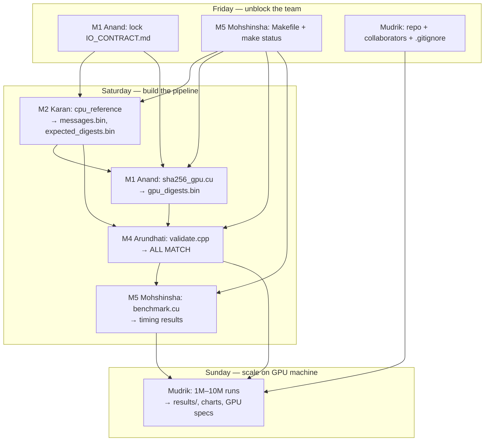

# Team Task Plan — GPU SHA-256 (C++ / CUDA)

**Group:** Group 29

**Deadline:** Sunday afternoon. **Today:** Friday.
**Core language:** C++ (CUDA is C++; CPU reference uses OpenSSL in C++).
**Working window:** Fri afternoon → Sat (full day) → Sun morning → Sun afternoon = submit.

## Team

| Name | Roll No. | Role | Owns |
|------|----------|------|------|
| **Anand Pal** | G25AIT1019 | I/O contract + CUDA kernel | `IO_CONTRACT.md`, `sha256_gpu.cu` |
| **Arundhati** | G25AIT1033 | Correctness validation tool | `validate.cpp` |
| **Mohshinsha Harunsha Shahmadar** | G25AIT1093 | Benchmark harness + build system + report | `benchmark.cu`, `Makefile` |
| **Mudrik Kaushik** | G25AIT1096 | Repo setup + large-scale GPU runs | GitHub repo, `results/` |
| **Karan Kapoor** | G25AIT1233 | CPU reference & dataset generator | `cpu_reference.cpp` |

---

## Who unblocks whom

Work flows in **dependency order**. A task below cannot be finished (or trusted at scale) until its upstream tasks are done.

| Person | Unblocks | Why |
|--------|----------|-----|
| **Anand** (M1) | **Everyone** (Friday) | Locks data formats and kernel API in `IO_CONTRACT.md` — without this, M2/M4/M5 cannot code against the same layout |
| **Mohshinsha** (M5) | **Everyone** (Friday) | `Makefile` + `make status` — so all modules build the same way once source files land |
| **Mudrik** | **Everyone** (Friday) | Repo, folders, `.gitignore`, collaborators — so code is shared via Git, not ad hoc |
| **Karan** (M2) | **Anand**, **Arundhati** | Produces dataset + `expected_digests.bin`; Anand needs input files; Arundhati can test logic against CPU ref before GPU is ready |
| **Anand** (M1) | **Arundhati** | Produces `gpu_digests.bin`; validator cannot prove correctness without it |
| **Arundhati** (M4) | **Mohshinsha**, **Mudrik** | `ALL MATCH` on small data is the gate for trustworthy benchmarks and large-scale runs |
| **Mohshinsha** (M5) | **Mudrik** | Benchmark harness produces official GPU vs CPU numbers for the report |
| **Mudrik** | **Report / submit** | Only person with the big GPU machine — final 1M–10M correctness + headline throughput |

**Partial parallel work (before upstream is done):**

| Can start early | Depends only on |
|-----------------|-----------------|
| Arundhati: validator structure + edge-case tests | `IO_CONTRACT.md`, Karan's `expected_digests.bin` (no GPU yet) |
| Anand: device SHA-256 math in `sha256.cuh` | `IO_CONTRACT.md`, NIST vectors |
| Mohshinsha: `Makefile`, report outline | `IO_CONTRACT.md` |
| Karan: generator | `IO_CONTRACT.md` (after Friday lock) |

---

## The key workflow: develop small (Colab) → run big (Mudrik's machine)

Only Mudrik has the GPU machine. So **everyone develops and tests on Colab with a
SMALL dataset** (1K–10K messages), and once it works, **Mudrik runs the big jobs**
(1M–10M messages) on his machine for the final correctness check and benchmarks.

**Consequence:** Mudrik is *downstream* — his runs are only meaningful once the
kernel, validator, and dataset all work. So the **Saturday-evening milestone**
(everything passes on small data) is the whole game. Miss it and Mudrik has nothing
to scale on Sunday.

**Code travels via Git only.** Mudrik must be able to `git pull && make && ./run`.
No emailing files around.

---

## Anand Pal (G25AIT1019) — I/O contract + CUDA kernel
**Owns:** `IO_CONTRACT.md`, `sha256_gpu.cu`

**What to do**
1. **Finalize `IO_CONTRACT.md`** and walk the team through it Friday. Lock the data
   formats and function signatures — this is what lets the other four work in parallel.
2. Build `sha256_gpu.cu` (start from `sha256_multi.cu`): replace the 4 hardcoded
   messages with code that **loads Karan's `.bin` dataset**, runs the kernel, and writes
   `gpu_digests.bin` (same layout as `expected_digests.bin`).
3. Keep the SHA-256 math (`transform`/`hash`) unchanged — it's verified.
4. Stretch (Sun): confirm constants are in `__constant__`, try block sizes 128/256/512.

**How to complete / tips**
- The kernel barely changes; your real work is the host-side `.bin` load/save plumbing
  (`std::ifstream` in binary mode).
- Test on Colab with a small dataset until it prints `ALL PASS`, then push for Mudrik.
- **Done when:** loads Karan's dataset, runs the kernel, writes `gpu_digests.bin`, passes on small data.

---

## Karan Kapoor (G25AIT1233) — CPU reference & dataset generator (C++ / OpenSSL)
**Owns:** `cpu_reference.cpp`

**What to do**
1. Write a C++ program using **OpenSSL** (`#include <openssl/sha.h>`, `SHA256(...)`) that:
   - Generates N synthetic messages (varying lengths).
   - Computes each digest with OpenSSL (the trusted CPU baseline).
   - Writes the I/O-contract §4 files: `messages.bin`, `offsets.bin`, `lengths.bin`,
     `expected_digests.bin`, `meta.txt`.
2. Embed the **NIST test vectors** (`""`, `"abc"`, the 56-byte string) at the front and
   assert OpenSSL matches their published hashes (your correctness gate).
3. Make N a command-line argument (1K / 100K / 1M / 10M) for Mudrik's scaling runs.

**How to complete / tips**
- Colab: `!apt-get install -y libssl-dev`, then `g++ cpu_reference.cpp -o cpu_reference -lssl -lcrypto`.
- `generate_dataset.py` already shows the exact logic + file layout — **port it to C++**, keep the format identical.
- You're upstream of everyone — get a small dataset out **Saturday morning** so Anand/Arundhati can work.
- **Done when:** produces the 5 files, NIST asserts pass, byte counts match the contract.

---

## Arundhati (G25AIT1033) — Correctness validation
**Owns:** `validate.cpp`

**What to do**
1. Write a C++ tool that reads `gpu_digests.bin` (Anand) and `expected_digests.bin`
   (Karan) and compares them **slot by slot** (32 bytes each, `memcmp`).
2. Report: total messages, number matching, and the **first mismatch** (index + both hex
   digests) so Anand can debug. Print `ALL MATCH` / `N MISMATCHES`.
3. Build an **edge-case suite**: empty string, 1 byte, exactly 55 / 56 / 64 bytes
   (block-boundary cases), a multi-block message. These catch padding/endian bugs.
4. Own the "is it correct?" answer for the report.

**How to complete / tips**
- Fully independent C++ — build and test against Karan's files before Anand's kernel is even done.
- The 55/56/64-byte lengths are exactly where SHA padding bugs hide — make those explicit tests.
- Your tool is what Mudrik runs at scale, so make it work on small data first.
- **Done when:** reports `ALL MATCH` on a small dataset and your edge-case suite passes.

---

## Mohshinsha Harunsha Shahmadar (G25AIT1093) — Benchmark harness + build system + report
**Owns:** `benchmark.cu`, `Makefile`, report assembly

**What to do**
1. Write `benchmark.cu`: wrap the kernel launch in **CUDA event timers** to measure pure
   GPU compute. Report **hashes/sec** and **GB/s**, with and without host↔device transfer
   (report both). Also time the **CPU baseline** (Karan's OpenSSL, single-threaded).
2. Write a **`Makefile`** so anyone builds everything with `make` (nvcc for `.cu`,
   `g++ -lssl -lcrypto` for OpenSSL code).
3. Assemble the **report**: collect each member's section, write the intro + security note.

**How to complete / tips**
- CUDA events: `cudaEventCreate/Record/Synchronize/ElapsedTime` around the launch. **Warm up**
  with one throwaway run before timing.
- You write the harness; **Mudrik runs it at scale** and gives you the numbers/charts.
- Start the Makefile Friday so everyone can `make` from day one.
- **Done when:** `benchmark.cu` runs and times GPU vs CPU; `make` builds the whole project.

---

## Mudrik Kaushik (G25AIT1096) — Repo setup + large-scale runs on the GPU machine
**Owns:** the GitHub repo + folder skeleton, and the final results (correctness at scale + benchmarks)

**What to do — Part A: repo setup (FRIDAY, first thing — unblocks everyone)**
1. Ensure the GitHub repo `gpu_assignment` has all 5 members as collaborators.
2. Create the **modular folder skeleton** from `REPO_STRUCTURE.md` (folder per member,
   shared `include/`, `data/`+`results/` gitignored). Commit each folder with a placeholder
   README so they exist in Git from the start.
3. Add the `.gitignore` (ignore `data/*.bin`, binaries, `build/`) and push to `main`.
4. Tell everyone the repo URL + their folder so they can clone and start pushing.

**What to do — Part B: large-scale runs (SAT evening → SUN)**
1. Set up the machine once: confirm `nvidia-smi` + `nvcc --version`, install `libssl-dev`,
   `git clone` the repo.
2. Once the others' code works on small data (Sat evening), **run the full pipeline big**:
   - Karan's generator → 1M then 10M dataset.
   - Anand's kernel → `gpu_digests.bin`.
   - Arundhati's `validate.cpp` → confirm **ALL MATCH** at scale.
   - Mohshinsha's `benchmark.cu` → GPU-vs-CPU across sizes (1K→10M).
3. Produce the **headline numbers**: hashes/sec, GB/s, the **scaling curve**, and the exact
   GPU model/specs from `nvidia-smi` for the report.

**How to complete / tips**
- You're downstream — your big runs need everyone else *done*. Push them to finish small by Sat night.
- Run each benchmark a few times and report the median; note transfer-time-included vs not.
- The headline result is the **speedup-vs-size curve** — that's the project's main finding.
- **Done when:** ALL MATCH on 10M messages + a benchmark table/chart of GPU vs CPU across sizes.

---

## All — Report & security note
Each member writes the section for their own piece; Mohshinsha stitches it together:
- Algorithm overview (SHA-256) + parallel design (one thread per message).
- Correctness results (Arundhati/Mudrik) + benchmark results & charts (Mohshinsha/Mudrik).
- **Security note:** GPUs make brute-forcing *fast* hashes cheap, which is why real password
  storage uses *slow, memory-hard* hashes (Argon2/bcrypt). Note where GPU crypto is useful
  (bulk hashing, integrity, mining) vs. a risk.

---

## Timeline (Fri → Sun)

### Friday (today) — setup & unblock
- **Mudrik (FIRST):** create the GitHub repo + modular folder skeleton (`REPO_STRUCTURE.md`),
  add everyone as collaborator, push `.gitignore`. Share the URL. *This unblocks all pushes.*
- **Anand:** lead 15-min sync, lock `IO_CONTRACT.md`, get `sha256_multi.cu` printing `ALL PASS`.
- **Mohshinsha:** start the `Makefile`; everyone runs `colab_starter.ipynb` → `SETUP OK`.
- **Mudrik:** set up the GPU machine (driver, nvcc, libssl-dev, clone repo).
- **Karan:** start porting the generator to C++/OpenSSL.
- ✅ End of Friday: repo live, contract agreed, everyone's GPU compiles, Anand's base passes.

### Saturday — build it (the big day)
- **Karan:** finish C++ generator → small dataset out by morning, then a 1M set.
- **Anand:** kernel loads Karan's dataset, writes `gpu_digests.bin` (test small).
- **Arundhati:** `validate.cpp` working + edge-case suite, run against Anand+Karan output.
- **Mohshinsha:** `benchmark.cu` timing on small data; `make` builds everything.
- 🎯 **End of Saturday (the milestone):** validator reports **ALL MATCH** on small data, all code pushed to Git.

### Sunday morning — scale up & benchmark (Mudrik's turn)
- **Mudrik:** pull latest, run 1M then 10M — confirm ALL MATCH at scale, run benchmarks, make charts.
- **Anand:** light kernel optimization if time (block size, constant memory).
- **Arundhati:** lock the correctness claim; **Karan:** generate any extra dataset sizes Mudrik needs.

### Sunday afternoon — integrate & submit
- **Mohshinsha:** assemble report + final results; **all:** write your section. **Submit.**

---

## Rules that keep everyone unblocked
1. **Friday: lock the I/O contract first** (Anand). It's what lets everyone parallelize.
2. **Correctness before speed** — no optimization until validation says ALL MATCH.
3. **Test NIST vectors + edge lengths (55/56/64) early** — that's where bugs hide.
4. **Everything via Git** so Mudrik can pull and run big. No emailing files.
5. **Saturday-evening milestone is the whole game:** all code works on small data, so Mudrik can scale Sunday.
